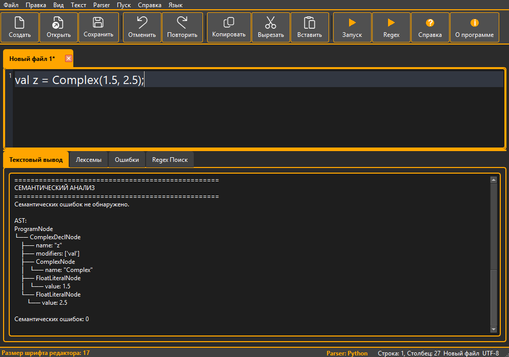
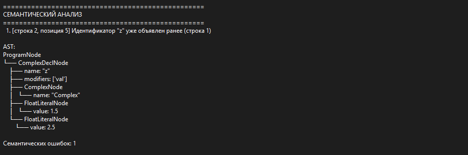
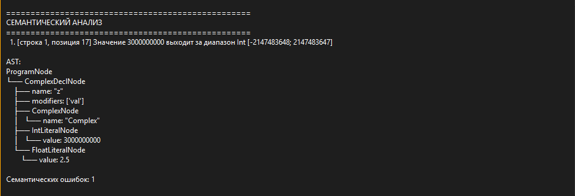
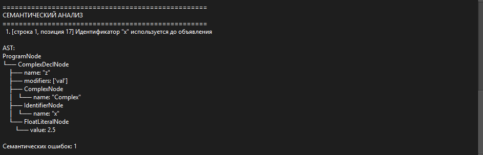
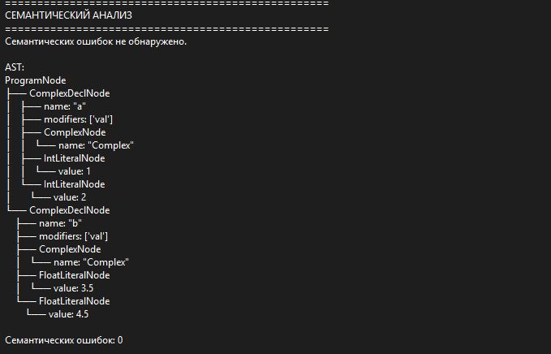
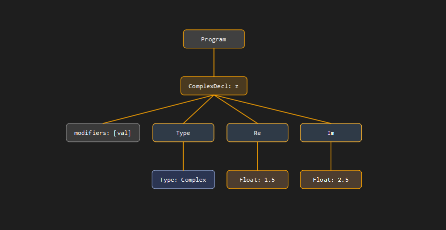
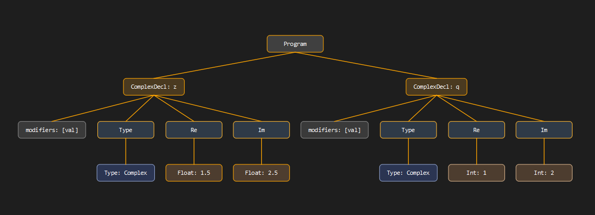

# Лабораторная работа 5: Построение AST и проверка контекстно-зависимых условий

## Название работы и автор

- **Работа:** Семантический анализатор для объявления комплексного числа в Scala
- **Автор:** Васильев Антон Романович
- **Группа:** АВТ-314
- **Вариант:** 8

## Цель работы

Изучить назначение семантического анализатора в компиляторе, построить абстрактное синтаксическое дерево (AST) и реализовать проверку контекстно-зависимых условий для синтаксической конструкции курсовой работы.

## Вариант задания

Анализируемая конструкция:

```scala
val z = Complex(1.5, 2.5);
```

Примеры корректных строк:

```scala
val z = Complex(1.5, 2.5);
val a = Complex(0, -3.14);
val b = Complex(10, 20);
```

## Контекстно-зависимые условия

Реализованы проверки в модуле `semantic_analyzer.py`:

1. **Уникальность идентификаторов**
   - Повторное объявление `val` с тем же именем в одной области видимости — ошибка.
   - Пример: `Идентификатор "z" уже объявлен ранее (строка 1)`.

2. **Совместимость типов**
   - Аргументы конструктора `Complex(re, im)` должны быть числовыми (`Int` или `Float`).
   - Пример: `Несовместимость типов: аргументы Complex должны быть числовыми, получено (Complex, Int)`.

3. **Допустимые значения**
   - Для целых литералов — диапазон `Int: [-2147483648; 2147483647]`.
   - Для вещественных — ограничение по модулю `1.0e100`.
   - Пример: `Значение 3000000000 выходит за диапазон Int [...]`.

4. **Использование идентификаторов**
   - Идентификатор в аргументах `Complex(...)` должен быть объявлен ранее.
   - Пример: `Идентификатор "x" используется до объявления`.

## Структура AST

Основные типы узлов:

- `ProgramNode` — программа (список объявлений).
- `ComplexDeclNode` — объявление `val` с конструктором `Complex`.
- `ComplexNode` — тип `Complex`.
- `FloatLiteralNode` — вещественный литерал.
- `IntLiteralNode` — целочисленный литерал.
- `IdentifierNode` — идентификатор.

Пример AST для `val z = Complex(1.5, 2.5);`:

```
ProgramNode
└── ComplexDeclNode
    ├── name: "z"
    ├── modifiers: ['val']
    ├── ComplexNode
    │   └── name: "Complex"
    ├── FloatLiteralNode
    │   └── value: 1.5
    └── FloatLiteralNode
        └── value: 2.5
```

Рисунок AST для отчёта: `screenshots/ast_graph.png` (draw.io).

## Формат вывода программы

После запуска анализатора (`F5`) выводятся:

1. Результаты лексического анализа.
2. Результаты синтаксического анализа.
3. Семантические ошибки с позицией (`строка N, позиция M`).
4. AST в текстовом виде (с отступами `├──`, `└──`).
5. Количество семантических ошибок отдельной строкой.

## Тестовые примеры

1. **Корректное объявление**
   ```scala
   val z = Complex(1.5, 2.5);
   ```
   

2. **Повторное объявление**
   ```scala
   val z = Complex(1.5, 2.5);
   val z = Complex(3.0, 4.0);
   ```
   

3. **Выход за диапазон Int**
   ```scala
   val z = Complex(3000000000, 2.5);
   ```
   

4. **Необъявленный идентификатор**
   ```scala
   val z = Complex(x, 2.5);
   ```
   

5. **Несколько объявлений**
   ```scala
   val a = Complex(1, 2);
   val b = Complex(3.5, 4.5);
   ```
   

## Дополнительное задание: графическая визуализация AST

Реализована отдельная функция визуализации AST в графическом виде (модуль `ast_viewer.py`).

### Как открыть граф AST

1. Запустить анализатор (`F5`) на корректном входе без синтаксических ошибок
2. Нажать **Показать AST** (`F6`) или кнопку на панели инструментов
3. Откроется отдельное окно с деревом

### Что отображается в узлах

- `Program`, `ComplexDecl: z`, `Type: Complex`
- `Float: 1.5`, `Int: 10`, `Id: name`
- `modifiers: [val]`

### Скриншоты графического AST

1. Графическое AST


1. Графическое AST — несколько объявлений
